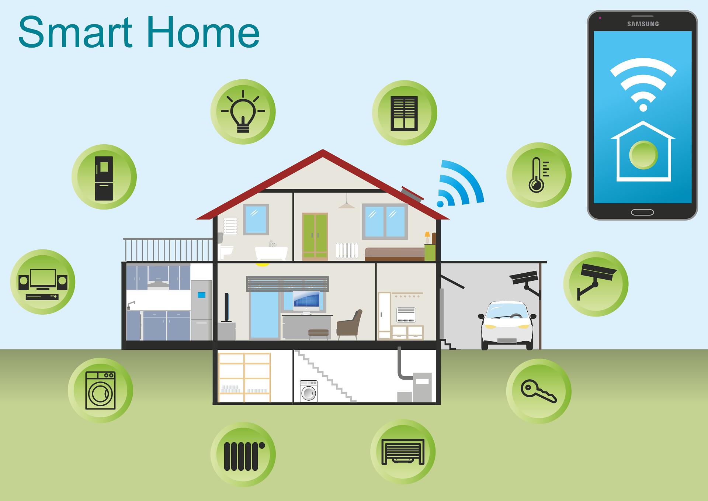

# SmartHome
### 아두이노 키트를 활용한 스마트홈 프로젝트

## 프로젝트 요약
> 6인 팀 프로젝트
> 2022.05.10 - 2022.06.8   
 
> **스마트 홈 팀 프로젝트**
* 기준치 이상의 진동 감지 시 LED와 부저, 스피커 모듈을 통한 위험 알림 및 LCD패널에 경고 문구를 띄우고 자동으로 출입문 개방
* 불길 발생 시 LED와 부저, 스피커 모듈을 통한 위험 알림 및 LCD패널에 경고 문구를 띄우고 자동으로 창문 개방
* 가스 누출 감지 시 부저를 통한 알림 및 자동으로 창문 개방
* 온습도 센서를 통해 내부 온도 및 습도를 측정하고 온도에 따라 에어컨 작동
* 토양 습도 센서를 이용해 집안 내 화초들의 토양 습도를 파악 후 토양 상태에 따라 3색 LED로 출력
* 음성인식 모듈을 이용해 필요한 명령을 녹음한 후 사용자가 음성으로 집안 모듈들을 작동가능
* 출입문과 창문, 주차장 개폐문은 서보모터를 이용해 각각 제어
* 주차장에 입차 시 일정 시간이 지나면 스피커 모듈을 통한 알림
* 스마트폰 앱을 통해 블루투스로 연결 후 서보모터 및 LED, LCD패널을 각각 원격 제어 가능
 

## 프로젝트 로직

## 담당 역할
### 무드등 제어
 
* 3색 LED 모듈과 turnOnOffLights 메서드를 사용하여 외출 시 혹은 외출 하지 않을 시의 기능 구현
* 블루투스 모듈(hm10)과 앱을 연동하여 문자(무드등: a,b)입력에 따른 무드등 제어 구현
### 스마트 주차장
 
* 서보모터 및 초음파 센서, LCD를 활용하여 감지거리에 따른 주차장 개폐
* LCD를 통해 현재 차의 출입 여부 확인
* 서보 모터에 5초간의 딜레이와 10도씩 증가를 통한 사물의 유무 확인
### 식물 성장 감지 시스템
 
* 3색 led를 통해 식물의 성장 조건에 입각한 수분 및 습도 확인

## 결과 영상
* https://youtu.be/mnzqHEc9V-g
